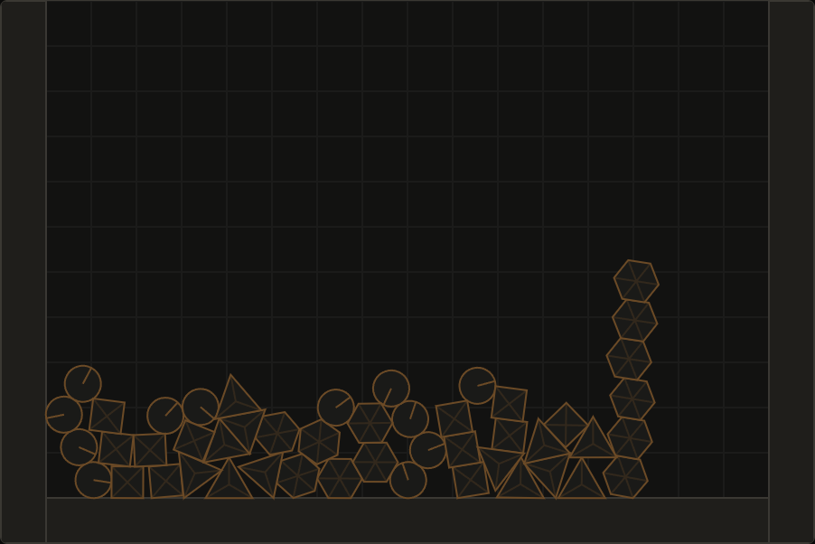

# Impulse

A 2D rigid body physics engine written from scratch in TypeScript. No physics libraries. Design reference: Box2D Lite (Erin Catto).

Live demo: https://kaan0d.github.io/impulse/ (live once the deploy workflow has run, see Deployment)

Benchmark: https://kaan0d.github.io/impulse/bench/



## What it does

- **Bodies:** circles, boxes and convex polygons (up to 16 vertices), dynamic or static (`mass = Infinity`).
- **Collision:** SAT with reference-face clipping for boxes and polygons (up to two contacts), closest-feature tests for circles, and a spatial-hash broadphase.
- **Contacts:** a soft-step solver (after Box2D v3): 4 substeps per step, soft contact constraints, an unbiased relax pass, warm starting, and a restitution pass at the end. Bodies closer than 2 cm already make contacts (speculative contacts), so a fast body is stopped before it touches. Friction, restitution, rolling resistance and linear and angular damping.
- **Queries and filtering:** raycast against every shape, box overlap query, and per-body category, mask and group filters.
- **Sleeping:** touching bodies form islands that fall asleep together and wake on contact or when a joint partner wakes.
- **Continuous collision:** fast bodies cannot tunnel through static geometry.
- **Joints:** pin (with angle limits and a motor), rod, spring, rope, and a mouse joint for grabbing.
- **Demo:** several scenes, drag-and-drop spawning of six shapes, grabbing with the mouse, pause, step, reset, speed control, and debug overlays.

## Rules

- Fixed timestep (1/60 s) with an accumulator. Render dt never reaches physics.
- Deterministic: no `Math.random`, same input gives bit-identical output.
- No allocations in hot paths (step, narrowphase, solver). This is a design goal that no test enforces.
- The engine (`src/engine/`) never touches DOM or Canvas.

## Commands

| Command | What it does |
| --- | --- |
| `npm run dev` | Start the demo |
| `npm test` | Run unit tests (Vitest) |
| `npm run e2e` | Run browser tests (Playwright, installed Google Chrome). Builds and serves the site itself |
| `npm run typecheck` | `tsc --noEmit`, strict mode |
| `npm run build` | Production build under the `/impulse/` base path |
| `npm run bench` | Open the benchmark page |

## Structure

```
src/engine/   pure physics: Vec2, Body, World, FixedStepper, collide (+ collide-convex, clip),
              Manifold, Solver, Sleeper, SpatialHash, Joint, continuous collision (ccd)
src/render/   Canvas drawing and debug overlays
src/demo/     demo scenes and the page controller
bench/        benchmark page (separate Vite entry)
tests/        Vitest unit tests
e2e/          Playwright browser tests
.githooks/    pre-commit hook
.github/      CI and Pages deploy workflows
```

## What is tested, and what is not

Unit tests (Vitest) and browser tests (Playwright) run against the engine and the built site.

| Claim | Evidence |
| --- | --- |
| Integration is correct | Free-fall velocity matches the analytic result, position matches the exact semi-implicit Euler sum, and stays within the first-order error of the continuous formula |
| Physics never sees frame time | Different frame rates give the same state as stepping by hand |
| Deterministic | Reruns are bit-identical for towers, polygon piles, joint chains and all joint features together, sleep flags included |
| Collision is right | Known overlaps give the expected normal, depth and points for every shape pair. Polygons agree with the box-box path on 4000 random pairs, and circle-polygon depth matches an independent distance computation |
| Solver behaves physically | Bodies rest with penetration under 0.01, elastic collisions conserve energy and momentum to 1e-9, friction decelerates at μg, resting impulses equal the weight per substep, impulses never pull |
| Bounces are right | A ball rebounds to within 2% of its drop height, because restitution reads the speed before gravity is added |
| Rolling and damping | A rolling ball slows at (2/3)·r_roll·g/r, damping scales speed by 1/(1 + h·d) per substep |
| Queries and filters | Raycast hits and normals match the analytic circle, box and hexagon; masks, groups and continuous collision honour the filters |
| Contacts within the margin | Every shape pair makes a contact with negative depth at a 1.5 cm gap and none at 3 cm; a ball closing on a wall at 20 m/s stops at the surface; a body sliding past a wall keeps its speed; a 250 m/s bullet never stays pinned |
| Big piles sleep | A pile of 500 mixed bodies falls fully asleep in about 6.7 s (4.7 s with rolling resistance) |
| Stacks stand and sleep | 10-, 15- and 20-box towers stand, and they fall asleep within seconds (a 10-box tower in under 3 s) |
| Broadphase is exact | The spatial hash finds the same pairs as brute force across five cell sizes, with polygons included |
| Joints hold | A pin pendulum's period is within 2% of the physics formula, limits and motor torque caps hold, a spring's deflection and frequency match `g/ω²` and `f`, ropes go slack and taut |
| No tunneling | Fast circles, boxes and polygons stop at thin static walls, and pass through them when continuous collision is off |
| Demo works in a browser | Drag-and-drop spawning, mouse grabbing, pause, step, reset, scene switching, overlays and the benchmark page run in Chrome with no console errors |
| Deploy base path | Every URL in the built pages is relative or under `/impulse/` |

Several tests were also checked by breaking the code on purpose and confirming they fail.

Not covered:

- Determinism was only checked on one machine's Node and Chrome. Other browsers or CPUs may differ in `Math.sin` and `Math.cos`.
- Contact stiffness (40 Hz) was tuned with the stacking and sleep tests: 60 Hz sags a 20-box tower less but jitters, and 45 Hz fails two sleep tests. A 20-box tower still compresses by a few centimetres.
- The 2 cm contact margin is a fixed constant. A body that starts a step more than 2 cm from a surface and moves farther than that in one step (over 1.2 m/s at 60 Hz) is not seen by the contacts, so thin static geometry still needs continuous collision, which stops the body at the surface and lets the contact take over.
- Polygon contacts use face axes only, so two corners that are diagonally close can make a contact along a face normal although they are farther apart than 2 cm. It only limits approach speed along that normal.
- Whether a big pile ever falls asleep depends on the chaotic details: a box can rock on a ball for a long time (sleeps at 6.7 s here, but an earlier solver state never did). Rolling resistance made it robust: 0.01, 0.03 and 0.06 all fell asleep at about 6 s.
- Continuous collision only stops bodies at static geometry. Two fast dynamic bodies can still pass through each other.
- The deploy workflow has not run yet, and the benchmark numbers are from one machine.

## Roadmap

One commit per stage: `stage N: <summary>`. A stage is done when its tests are green and its demo works.

| Stage | Adds | Tests |
| --- | --- | --- |
| 1. Bodies and integration | Vec2, circle and box bodies, semi-implicit Euler, gravity, fixed-timestep loop, Canvas renderer, drag-and-drop spawning | Free fall matches the analytic result; fixed timestep is deterministic |
| 2. Collision detection | SAT for box/box, circle/circle, circle/box; contact manifold | Known overlaps give the expected normal, depth and contact points; no contact when apart |
| 3. Impulse solver | Sequential impulses, friction, restitution, accumulated impulse clamping | Box falls and comes to rest on the ground (velocity ~0, penetration < 0.01); elastic collisions conserve energy |
| 4. Stacking stability | Warm starting, sleeping | 10-box tower stands for 10 s without toppling; same scene twice is bit-identical |
| 5. Broadphase | Spatial hash | Same pair set as brute force |
| 6. Joints (optional) | Distance / revolute constraints | Joint length and anchor stay within tolerance under load |
| 7. Benchmark and deploy | Benchmark page (`bench/`), results table below, GitHub Actions deploy to Pages | Build works under the Pages base path |
| 8. Convex polygons | Polygon bodies, general SAT with clipping, circle-polygon, polygon spawning in the demo | Mass properties match closed forms; polygons agree with the box path and an independent distance oracle; polygons rest flat |
| 9. Stability | 2-point block solver, sequential position correction, continuous collision against statics | 15- and 20-box towers stand and sleep; bullets stop at thin walls |
| 10. Joint upgrades | Angle limits, motors, springs, ropes, mouse joint, joint removal | Limits and torque caps hold, spring frequency and deflection match theory, rope slack behaviour |
| 11. Interactive demo | Scene picker, mouse grabbing, pause, step, reset, speed, overlay toggles, more scenes | Point queries and world reset; every scene simulates cleanly |
| 12. Automation | Pre-commit hook, CI on pull requests, Playwright browser tests | 14 browser tests against the built site |
| 13. Bounce fix | Restitution reads the speed before gravity | A ball rebounds within 2% of its drop height |
| 14. Queries and filtering | Raycast, box overlap query, category, mask and group filters | Analytic ray hits, filters honoured by contacts and continuous collision |
| 15. Soft-step solver | Substeps, soft contacts, relax pass, restitution pass; block solver and position projection removed | All earlier tests still pass, including 20-box towers and joint tolerances |
| 16. Damping and rolling resistance | Linear and angular damping, warm-started rolling resistance, circle anchors that do not spin | Rolling ball matches theory, 500-body pile falls asleep |
| 17. Speculative contacts | Contacts within a 2 cm margin for every shape pair, broadphase boxes grown to match | A body closing on a wall stops before it sinks in; bullets never stay pinned |

## Status

- [x] Stage 1
- [x] Stage 2
- [x] Stage 3
- [x] Stage 4
- [x] Stage 5
- [x] Stage 6 (optional)
- [x] Stage 7
- [x] Stage 8
- [x] Stage 9
- [x] Stage 10
- [x] Stage 11
- [x] Stage 12
- [x] Stage 13
- [x] Stage 14
- [x] Stage 15
- [x] Stage 16
- [x] Stage 17

## Benchmark results

`npm run bench` opens the benchmark page (`bench/index.html`, also built and served at `/impulse/bench/`). It runs deterministic scenes through the full `World.step` (contacts, 10 solver iterations, integration, sleeping) and times the broadphase against a brute-force O(n²) test.

Measured on the production build (`vite build` then `vite preview`) in headless Chrome 153 driven by Playwright, Windows 11, AMD Ryzen 7 5800X. Timer resolution is 0.1 ms, and two runs differed by up to about 12% (the pyramid), usually by less. Numbers from your machine will differ.

### Step time

| Scene | Bodies | Steps | Avg ms | p95 ms | Max ms | Peak contacts | Awake at end |
| --- | --- | --- | --- | --- | --- | --- | --- |
| Pyramid, 210 boxes | 210 | 240 | 1.18 | 1.40 | 2.10 | 546 | 210 |
| Pyramid, 210 boxes, sleeping on | 210 | 240 | 0.20 | 1.20 | 1.40 | 546 | 0 |
| Pile, 500 bodies | 500 | 480 | 1.44 | 1.80 | 2.10 | 959 | 500 |
| Pile, 500 bodies, sleeping on | 500 | 480 | 1.03 | 1.70 | 2.10 | 959 | 0 |
| Pile, 500 bodies, sleeping on, rolling resistance | 500 | 600 | 0.67 | 1.70 | 2.10 | 922 | 0 |
| Pile, 1000 bodies | 1000 | 300 | 2.47 | 3.60 | 4.80 | 2003 | 1000 |

- Scenes without "sleeping on" keep every body awake, so they measure the solver under load. The 1/60 s budget is 16.7 ms.
- Both the pyramid and the 500-body pile fall fully asleep now. The pyramid's cost drops by about 6x, and the pile's average by about 28% over 8 s (rolling resistance: 10 s, average 0.67 ms). Before stage 16 the pile never fell asleep.
- The first 20 steps of each scene are untimed warm-up.
- Stage 17's speculative contacts add contacts for boxes that sit within 2 cm of each other, which is most of a pyramid's side-by-side boxes: peak contacts rose from 401 to 546 and the awake pyramid from 0.92 to 1.18 ms (+28%). The 500-body pile went from 1.33 to 1.44 ms and the 1000-body pile from 2.18 to 2.47 ms.
- Stage 15 replaced the 10-iteration solver with 4 substeps (soft contacts, relax pass). The pyramid took 0.86 ms and the 1000-body pile 2.59 ms before it; the numbers above are from the same machine and browser. An earlier version of this table (30 solver iterations, headed Chrome, before the block solver) showed 3.3 ms for the pyramid and 10.4 ms for 1000 bodies. Both the iteration count and the browser mode changed, so the difference is not attributable to one cause.

### Broadphase

| Bodies | Overlapping pairs | Spatial hash ms | Brute force ms | Speedup | Same pairs |
| --- | --- | --- | --- | --- | --- |
| 250 | 123 | 0.03 | 0.12 | 4.4x | yes |
| 500 | 251 | 0.05 | 0.38 | 7.7x | yes |
| 1000 | 488 | 0.10 | 1.48 | 14.8x | yes |
| 2000 | 980 | 0.27 | 6.05 | 22.4x | yes |
| 4000 | 2064 | 0.60 | 25.70 | 42.5x | yes |

Spatial hash time grows about linearly with body count, brute force about quadratically. The comparison uses axis-aligned unit boxes at constant density, and the brute-force baseline is a bare bounding-box loop, not the full narrowphase.

## Automation

- **Pre-commit hook** (`.githooks/pre-commit`): runs the typecheck and unit tests before every commit. `npm install` points git at the folder through the `prepare` script. Skip it once with `git commit --no-verify`. The work is done by `pre-commit.mjs` in plain Node, so it needs no bash: on Windows, npm's own launcher is a bash script, and committing from an IDE or Git GUI without bash on its PATH fails with `/usr/bin/env: 'bash': No such file or directory`. On Linux or macOS the `pre-commit` file must be executable (`git update-index --chmod=+x .githooks/pre-commit` if it is not).
- **CI** (`.github/workflows/ci.yml`): on every pull request, runs the typecheck, unit tests, build and the browser tests, and uploads Playwright traces if something fails.
- **Deploy** (`.github/workflows/deploy.yml`): on every push to `main`, runs install, tests, typecheck and build, then publishes `dist/`.

## Deployment

The site is published by `.github/workflows/deploy.yml` with the official Pages actions. To enable it once, set **Settings → Pages → Source** to **GitHub Actions** in the repository. The build uses the base path `/impulse/`, so the demo is at `https://kaan0d.github.io/impulse/` and the benchmark at `https://kaan0d.github.io/impulse/bench/`.
