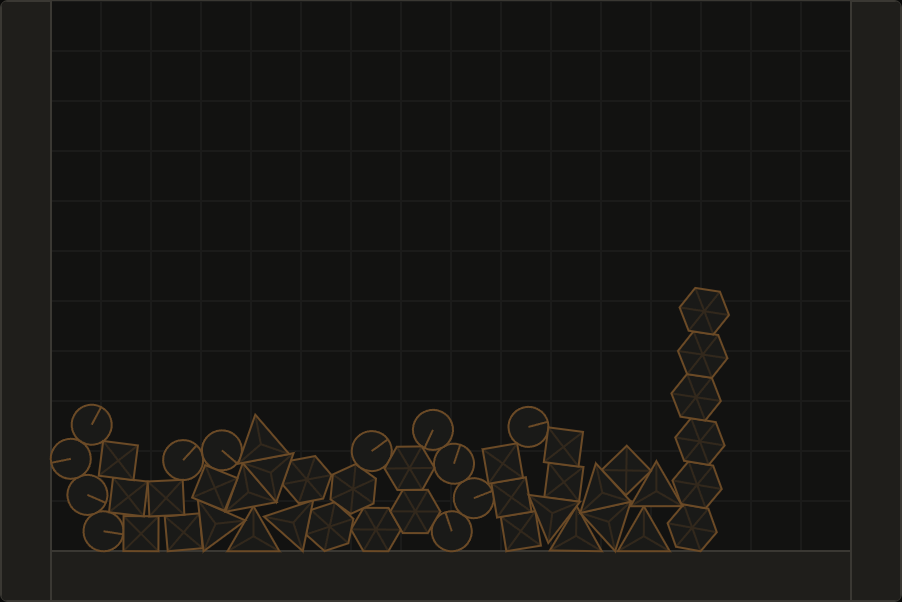

# Impulse

2D rigid body physics engine in TypeScript, written from scratch with no physics libraries. Design reference: Box2D Lite and Box2D v3 (Erin Catto).

Demo: https://kaan0d.github.io/impulse/ · Benchmark: https://kaan0d.github.io/impulse/bench/



## Features

- **Shapes:** circles, boxes, convex polygons (up to 16 vertices); dynamic or static.
- **Collision:** SAT with reference-face clipping (up to 2 contacts), closest-feature tests for circles, spatial-hash broadphase, speculative contacts (2 cm margin), continuous collision against static geometry.
- **Solver:** soft-step (4 substeps, soft contacts, relax pass, restitution pass) with warm starting. Friction, restitution, rolling resistance, linear and angular damping.
- **Joints:** pin (limits, motor), rod, spring, rope, mouse.
- **Other:** island sleeping, raycasts, box queries, category/mask/group filtering.

## Design rules

- Fixed 1/60 s timestep with an accumulator; render time never reaches the physics.
- Deterministic: same input gives bit-identical output (no `Math.random`).
- No allocations in hot paths (step, narrowphase, solver). This is a goal, not enforced by tests.
- `src/engine/` never touches the DOM or Canvas.

## Commands

```
npm run dev         # demo
npm test            # unit tests (Vitest)
npm run e2e         # browser tests (Playwright, builds and serves the site)
npm run typecheck   # tsc --noEmit, strict
npm run build       # production build under /impulse/
npm run bench       # benchmark page
```

## Verification

Tests check the physics against closed-form results, not only against snapshots:

- Free fall matches the analytic solution; frame rate never changes the state.
- Reruns are bit-identical for towers, piles and joint chains.
- Elastic collisions conserve energy and momentum to 1e-9; friction decelerates at μg; a ball rebounds within 2% of its drop height.
- Pendulum period within 2% of theory; spring deflection and frequency match `g/ω²` and `f`.
- Polygon collision agrees with the box path on 4,000 random pairs and with an independent distance oracle.
- The broadphase finds the same pairs as brute force; 10-, 15- and 20-box towers stand and sleep; fast bodies do not tunnel through thin walls.
- Playwright runs the demo and benchmark in Chrome with no console errors.

Several tests were checked by breaking the code on purpose.

## Benchmark

Production build, headless Chrome, Ryzen 7 5800X:

| Scene | Avg step | p95 |
|---|---|---|
| Pyramid, 210 boxes | 1.18 ms | 1.40 ms |
| Pyramid, 210 boxes, sleeping | 0.20 ms | 1.20 ms |
| Pile, 500 bodies | 1.44 ms | 1.80 ms |
| Pile, 1000 bodies | 2.47 ms | 3.60 ms |

Spatial hash vs. brute force: 4.4x faster at 250 bodies, 42.5x at 4,000.

## Limits

- Determinism was checked on one machine; `Math.sin`/`Math.cos` may differ across browsers or CPUs.
- Continuous collision only works against static geometry; two fast dynamic bodies can pass through each other.
- Contact stiffness is tuned, not derived: a 20-box tower still compresses by a few centimetres.

## Layout

```
src/engine/   Vec2, Body, World, collision, Solver, Sleeper, SpatialHash, Joint, CCD
src/render/   Canvas drawing and debug overlays
src/demo/     scenes and page controller
bench/        benchmark page
tests/ e2e/   Vitest and Playwright
```

A pre-commit hook (`.githooks/`, set up by `npm install`) runs the typecheck and unit tests. CI runs everything on pull requests; pushes to `main` deploy to GitHub Pages.
